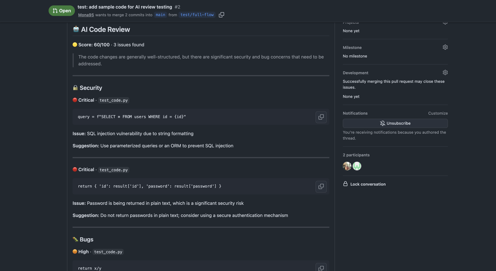

# 🤖 MR Review Agent

> AI-powered code review bot for GitHub Pull Requests.
> Automatically posts structured feedback on every PR — zero manual steps.



---

## What it does

When a pull request is opened — this bot automatically:

- Fetches the PR diff from GitHub
- Analyzes the code with AI (Groq + Llama 3.3)
- Posts a structured review comment with:
  - 🔒 Security vulnerabilities
  - 🐛 Bugs and potential failures
  - ⚡ Performance issues
  - ✨ Style suggestions
  - 👍 What looks good
  - 📊 Overall score out of 100

---

## Setup — 5 minutes

### 1. Get a free Groq API key

Go to [console.groq.com](https://console.groq.com) → create account → copy API key.
Free tier: 14,400 requests/day. No credit card needed.

### 2. Add the workflow to your repo

Create `.github/workflows/ai-review.yml`:

```yaml
name: AI Code Review

on:
  pull_request:
    types: [opened, synchronize]

jobs:
  review:
    runs-on: ubuntu-latest
    permissions:
      pull-requests: write
      contents: read

    steps:
      - name: Checkout code
        uses: actions/checkout@v4

      - name: Run AI Review
        uses: Mona95/mr-review-agent@main
        with:
          groq_api_key: ${{ secrets.GROQ_API_KEY }}
          github_token: ${{ secrets.GITHUB_TOKEN }}
        env:
          PR_NUMBER: ${{ github.event.pull_request.number }}
```

### 3. Add your Groq API key as a secret

### 4. Open a PR

That's it. Every PR you open will be automatically reviewed.

---
## How it works

PR opened <br/>
↓ <br/>
GitHub Actions triggers <br/>
↓ <br/>
Pulls pre-built Docker image from GHCR <br/>
↓ <br/>
Agent runs: <br/>

get_pr_diff() → fetches code changes from GitHub API <br/>
get_pr_context() → fetches PR metadata <br/>
review_code() → sends to Groq AI, gets structured feedback <br/>
format_review() → converts JSON to markdown <br/>
post_pr_comment() → posts comment on PR <br/> <br/>
↓ <br/>
Review appears on PR

---

## Tech stack

| Tool | Purpose |
|---|---|
| Python 3.11 | Core language |
| Groq + Llama 3.3 | AI model for code analysis |
| PyGithub | GitHub API integration |
| Docker | Containerisation |
| GitHub Actions | CI/CD automation |

---

## Local development

```bash
# Clone the repo
git clone https://github.com/Mona95/mr-review-agent
cd mr-review-agent

# Create virtual environment
python3 -m venv venv
source venv/bin/activate

# Install dependencies
pip install -r requirements.txt

# Set up environment
cp .env.example .env
# Fill in GROQ_API_KEY and GITHUB_TOKEN

# Run manually
python -m agent.main https://github.com/owner/repo/pull/5
```

---

## Cost

| Service | Cost |
|---|---|
| Groq API | Free (14,400 req/day) |
| GitHub Actions | Free (public repos) |
| GitHub Container Registry | Free (public images) |

**Total: €0**

---

## License

MIT — use it however you want.